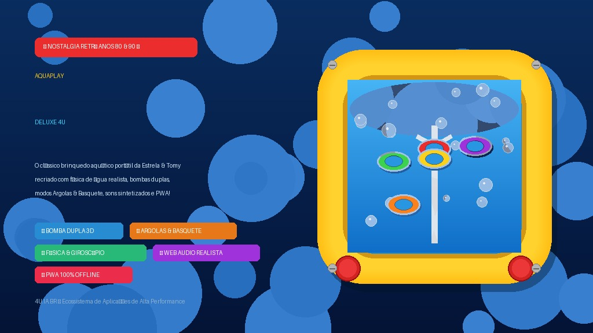

# 🌊 AquaPlay Vintage Deluxe 4U — Brinquedo Clássico dos Anos 80 & 90

<div align="center">

[](https://orcid.org/0009-0004-5936-5060)


<br>



<br><br>

[**🎮 Jogar AquaPlay Online**](https://4u.ia.br/app/aquaplay/) • [**4U.IA.BR**](https://4u.ia.br)

</div>

---

## ⚡ Visão Geral

O **AquaPlay Vintage Deluxe 4U** é a recriação digital definitiva e nostálgica do lendário brinquedo aquático portátil lançado pela **Estrela** e **Tomy** nos anos 80 e 90. 

Desenvolvido com física de fluidos realista em HTML5 Canvas, controle autêntico de **bombas duplas independentes** (esquerda e direita), modos clássicos de **Argolas** e **Basquete Aquático**, suporte a **sensor de inclinação (giroscópio mobile)**, sintetizador de áudio nativo Web Audio API e suíte completa PWA para jogar offline.

---

## ✨ Recursos Principais

* 🕹️ **Bomba Dupla Autêntica (Pistões Esquerdo e Direito):**
  * Bomba Esquerda: Gera corrente ascendente na esquerda com turbulência para o centro/direita.
  * Bomba Direita: Gera corrente ascendente na direita com turbulência para o centro/esquerda.
  * Combinação simultânea: Pressionar as duas bombas cria uma super corrente central vertical para alçar peças ao topo!
* 🎯 **Múltiplos Modos de Jogo Nostálgicos:**
  * **Argolas Clássicas:** Encaixe as 6 argolas toróides 3D coloridas nas hastes com alturas e pontuações variadas.
  * **Basquete Aquático (*Aqua Basket*):** Mire as bolinhas esportivas nas 3 cestas de acrílico com aro e rede submarina.
* 📱 **Giroscópio Real & Acelerômetro Mobile:**
  * Incline o smartphone ou tablet para os lados e frente para ver a gravidade e as peças se moverem conforme a inclinação real do seu aparelho!
* 🫧 **Câmara de Água Acrílica Hiper-Realista:**
  * Reflexos de vidro acrílico espesso em 3D.
  * Bolha de ar no topo flutuando na superfície da água, que oscila e reage aos jatos d'água.
  * Efeitos de cáusticas de luz no fundo e poeira submarina em suspensão.
* 🔊 **Sintetizador de Áudio Realista (Web Audio API):**
  * Zero dependência de arquivos externos MP3/WAV.
  * Sons sintetizados de compressão da borracha do pistão, borbulhar de água ascendente, clique plástico (*plink*) de impacto, som de agitação na água e fanfarra vintage de vitória.
* 🎨 **Temas do Gabinete Vintage:**
  * 🟡 *Amarelo Estrela 1982* (com botões vermelhos clássicos)
  * 🔵 *Azul Oceano Neon* (com botões amarelos)
  * 🔴 *Vermelho Arcade 1985* (com botões brancos)
* ⏱️ **Cronômetro & Recorde Pessoal (*Personal Best*):**
  * Modo contra o relógio com registro do melhor tempo gravado no navegador (`localStorage`).
  * Chuva de confetes em Canvas na vitória.
* 📲 **PWA Completo & 100% Offline:**
  * Ícones dedicados em alta resolução, manifesto e Service Worker com cache para instalação direta no Android, iOS ou Desktop.

---

## 🎮 Controles

| Ação | Toque / Mobile | Teclado |
| :--- | :--- | :--- |
| **Bomba Esquerda** | Tocar no botão vermelho **ESQ** | Tecla `Z` ou `←` |
| **Bomba Direita** | Tocar no botão vermelho **DIR** | Tecla `X` ou `→` |
| **Chacoalhar** | Botão verde central 🫨 | `Barra de Espaço` |
| **Reiniciar** | Botão de reset circular 🔄 | Tecla `R` |
| **Som Mudo/Ativo** | Ícone de alto-falante 🔊 | Tecla `M` |

---

## 🗂️ Estrutura do Projeto

```text
aquaplay/
├── index.html            # Aplicação completa com simulação física, áudio e UI vintage
├── manifest.json         # Manifesto PWA com metadados e atalhos de jogo
├── service-worker.js     # Cache offline de assets e lógica PWA
├── banner-16-9.jpg       # Banner oficial em alta resolução
├── icon-512.png          # Ícone PWA 512x512
├── icon-192.png          # Ícone PWA 192x192
├── apple-touch-icon.png  # Ícone para dispositivos iOS 180x180
├── favicon.png           # Favicon do navegador 64x64
└── README.md             # Documentação oficial
```

---

## 📄 Licença & Autoria

© 2026 **4U.IA.BR** • Desenvolvido com carinho para o ecossistema 4U.
